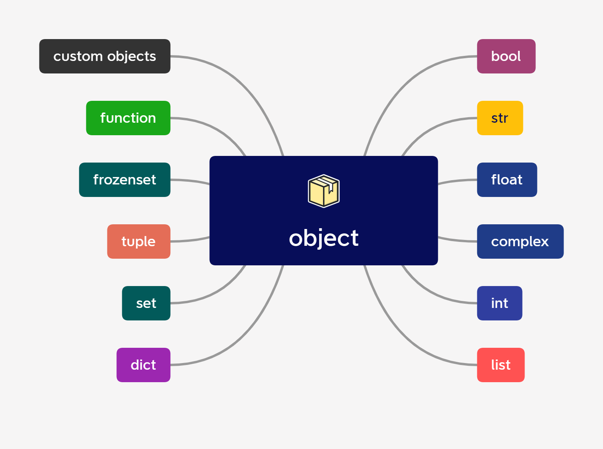

## 3. Переменные и объекты



Добро пожаловать в тему переменных и объектов!

На этой теме научитесь создавать и использовать переменные, которые являются ключевым элементом работы с данными.
Узнаете о том, как работают объекты и как присваивать значения переменным. Изучим, как выбирать правильные имена
для переменных и почему это важно.
Также научитесь получать пользовательский ввод с клавиатуры и использовать его в своих программах.

---

- [Объекты](#объекты)
- [Переменные](#переменные)
- [Имена идентификаторов](#имена-идентификаторов)
- [Пользовательский ввод с клавиатуры](#пользовательский-ввод-с-клавиатуры)
- [Задания по теме](#задания)

---

### Объекты

В Python всё - от простых типов данных, таких как булевы значения, целые числа и строки, до сложных структур данных,
функций и программ - реализовано как объекты.

Объект похож на прозрачный пластиковый ящик, который содержит фрагмент данных. Каждый объект имеет свой тип,
который определяет, что можно сделать с этим объектом и какие операции с ним можно производить.
Например, объект типа `str` можно складывать(конкатенировать) с другими строками, но нельзя сложить с числом.

Тип также определяет, можно ли изменить значение, которое хранится в объекте - некоторые объекты
называются неизменяемыми, а другие - изменяемыми.

В реальной жизни можно использовать пример с ящиками. Например, представьте, что у вас есть ящик с яблоками.
Этот ящик - объект типа `список`, потому что он содержит несколько элементов. Если вы хотите узнать,
сколько яблок в ящике, то вам нужно обратиться к свойству `длина` объекта списка. Если вы хотите добавить
в ящик ещё одно яблоко, то вы можете это сделать, потому что список - изменяемый объект.

Однако, если ящик с яблоками - объект типа `кортеж`, то он будет неизменяемым,
и вы не сможете добавить в него новое яблоко.

Объекты в Python могут быть созданы как встроенными типами данных, так и пользовательскими типами данных.
Каждый объект имеет уникальный идентификатор, который можно получить с помощью функции `id()`.

---

#### Встроенная функция `id()`

Функция `id()` возвращает уникальный идентификатор(адрес в памяти) объекта. Уникальный идентификатор объекта
не изменяется в течение жизни объекта. Это полезно, например, для отслеживания того, какие переменные ссылаются
на один и тот же объект.

Пример использования функции `id()`:

```python
# Создаем несколько объектов различных типов
a = 5
b = "Hello"
c = True

# Выводим их идентификаторы
print("Идентификатор a:", id(a))
print("Идентификатор b:", id(b))
print("Идентификатор c:", id(c))

# Создаем новые переменные, которые ссылаются на те же объекты
d = a
e = b

# Выводим их идентификаторы
print("Идентификатор d:", id(d))
print("Идентификатор e:", id(e))
```

Этот код выведет следующее:

```commandline
Идентификатор a: 94556813952256
Идентификатор b: 139804238528880
Идентификатор c: 94556813952288
Идентификатор d: 94556813952256
Идентификатор e: 139804238528880
```

Переменная `d` ссылаются на тот же объект, что и переменная `a`, поэтому они имеют один и тот же идентификатор.
Аналогично, переменная `e` ссылаются на тот же объект, что и переменная `b`.

**Атомарные и ссылочные типы данных**

При создании двух разных переменных с одинаковыми значениями атомарного типа, переменные имеют одинаковые 
идентификаторы.

Атомарные типы данных (числа, строки, кортежи и неизменяемое множество) являются неизменяемыми, и когда создается
новая переменная с одинаковым значением, Python может использовать уже существующий объект, чтобы сэкономить память.

Однако, при создании двух разных переменных с одинаковыми значениями ссылочного типа 
(списки, словари и т.д все изменяемые типы) каждая переменная будет ссылаться на отдельный объект в памяти.
В этом случае, переменные будут иметь разные идентификаторы, не смотря на одинаковые значения.

Например, рассмотрим следующий код:

```python
a = 10
b = 10
c = "hello"
d = "hello"
e = [1, 2, 3]
f = [1, 2, 3]

print("Идентификатор a:", id(a))
print("Идентификатор b:", id(b))
print("Идентификатор c:", id(c))
print("Идентификатор d:", id(d))
print("Идентификатор e:", id(e))
print("Идентификатор f:", id(f))
```

Вывод:

```commandline
Идентификатор a: 1687866704400
Идентификатор b: 1687866704400
Идентификатор c: 1687872435888
Идентификатор d: 1687872435888
Идентификатор e: 2203895845312
Идентификатор f: 2203896083456
```

Переменные `a` и `b` ссылаются на один и тот же объект, так как значение числа `10` является неизменяемым.
Также переменные `c` и `d` ссылаются на один и тот же объект строки `"hello"` является неизменяемым.
Однако переменные `e` и `f` ссылаются на разные объекты, так как списки являются изменяемыми и каждая
переменная создает новый объект списка.

---

#### Встроенная функция `type()`

Функция `type()` позволяет узнать тип объекта. Тип объекта определяет, какие действия можно с ним выполнять и
как он ведет себя в различных ситуациях.

Например, если вы хотите узнать тип числа, можно использовать функцию `type()` следующим образом:

```python
number = 42
print(type(number))  # <class 'int'>
```

Это покажет тип объекта `number`, который в данном случае является целым числом `int`.

Аналогично можно узнать тип других объектов, например, строки:

```python
some_text = "Hello, world!"
print(type(some_text))  # <class 'str'>
```

В этом случае `type()` покажет, что переменная `some_text` имеет тип строки `str`.

Знание типа объекта может быть полезно во многих случаях. Например, выполнить некоторые действия только с объектами 
определенного типа, в этих случаях можно использовать проверку типа с помощью `type()`. 

Например, вы можете проверить, является ли объект числом, используя такой код:

```python
number = 42
if type(number) == int:
    print("Переменная является целым числом.")

# Лучше использовать isinstance() для проверки типа переменной: if isinstance(number, int):
```

Это позволит выполнить блок кода только в том случае, если `number` является целым числом.

Также тип объекта может быть важен при выполнении операций с объектами разных типов, например, при выполнении
математических операций. В этом случае Python может автоматически приводить объекты разных типов к определенному типу,
чтобы выполнить операцию, но знание типа объекта может помочь избежать ошибок и неожиданного поведения.

---

### Переменные

Переменные - это имена, которые используются для обозначения значений в памяти компьютера. В Python для присвоения 
значения переменной используется символ `=`.

#### Присвоение значений переменным

Присвоение значения переменной выглядит так:

```python
x = 25
```

Здесь мы присваиваем значение `25` переменной `x`. Теперь, когда мы используем имя `x` в программе, оно будет ссылаться
на число `25`.

```python
print(x)  # 25
```

#### Множественное присвоение

Множественное присвоение позволяет присвоить несколько значений нескольким переменным с помощью единственного оператора
присваивания:

```python
x, y, z = 10, "Programming", 30
```

В этом примере мы присваиваем значения `10`, `"Programming"`, `30` переменным `x`, `y` и `z` соответственно.

Важно понимать, что в Python переменные являются ссылками на объекты. При присваивании переменной значения, мы
фактически создаем ссылку на объект в памяти компьютера, содержащий это значение. Переменные не имеют типа, как в других
языках программирования, и могут ссылаться на любой тип объектов, такие как числа, строки, списки и т.д.

```python
x = 8
print(type(x))  # <class 'int'>

x = "Hello, World!"
print(type(x))  # <class 'str'>
```

Здесь мы создали переменную `x` и присвоили ей значение `8`. Затем мы использовали встроенную функцию `type()` 
для вывода типа переменной `x`, который является целым числом `int`. Затем мы присвоили переменной `x` строковое
значение `"Hello, World!"` и снова использовали `type()`, чтобы убедиться, что тип изменился на строку `str`.

Не забывайте, что переменные могут быть переназначены, то есть вы можете изменить значение переменной в любой момент
программы.

Использование переменных делает ваш код более читаемым и понятным, так как вы можете давать осмысленные имена своим
значениям. Кроме того, переменные позволяют использовать одно значение в разных местах вашей программы, что делает ее
более модульной и гибкой.

Например, если вы используете число `42` в разных частях своего кода, вместо того чтобы просто использовать число `42`,
вы можете присвоить его переменной с осмысленным именем, например `answer_to_the_ultimate_question`, и затем
использовать эту переменную вместо числа `42`. Если вы захотите изменить это значение в будущем, вам нужно будет
поменять только одно место в вашем коде.

---

### Имена идентификаторов

Имена идентификаторов - это названия, которые вы используете в своем коде, чтобы обозначать переменные, функции, классы
и т.д. Выбор правильных имен для идентификаторов очень важен, так как плохо выбранные имена могут затруднить понимание
вашего кода другими программистами и даже вам самим через некоторое время.

Общие правила для именования идентификаторов:

- Имя должно начинаться с буквы или символа подчеркивания `_`;
- Имя может содержать буквы, цифры и символы подчеркивания;
- Имя должно быть уникальным в пределах своей области видимости;
- Имя не должно быть зарезервированным словом в Python.

Примеры правильных имен идентификаторов:

```commandline
name
age
total_price
_my_variable
MyClass
calculate_sum
```

Примеры неправильных имен идентификаторов:

```commandline
123number (начинается с цифры)
my-variable (содержит дефис)
total price (содержит пробел)
if (зарезервированное слово в Python)
```

Как вы можете видеть, некоторые символы, такие как дефис и пробелы, не могут быть использованы в именах идентификаторов.
Вместо этого используйте символ подчеркивания для разделения слов.

Кроме того, Python имеет список зарезервированных слов, которые нельзя использовать в качестве имен идентификаторов.
Например, слова `if`, `else`, `for`, `while` и т.д. 
Если вы попытаетесь использовать зарезервированное слово в качестве имени идентификатора, получите ошибку. 
Чтобы избежать ошибки, используйте другое имя.

* _Список зарезервированных слов [здесь](https://docs.python.org/3.10/reference/lexical_analysis.html#keywords)_;
* _Список встроенных функций [здесь](https://docs.python.org/3.10/library/functions.html#built-in-functions)_.

---

### Пользовательский ввод с клавиатуры

Получение данных от пользователя является важной частью многих программ. В Python для этого используется встроенная
функция `input()`. Она позволяет получить данные, введенные пользователем, и сохранить их в переменной для дальнейшего
использования в программе.

Функция `input()` позволяет пользователю вводить данные в консоли и возвращает введенную строку. 

Вот пример использования:

```python
name = input("Введите ваше имя: ")
print("Привет, " + name + "!")
```

В этом примере пользователь вводит свое имя в консоли, и оно сохраняется в переменной `name`. Затем программа выводит
сообщение, содержащее имя пользователя.

Обратите внимание на аргумент, переданный функции `input()`. Этот аргумент представляет собой строку, которая будет
выведена в консоль для запроса ввода. Она может быть любой строкой, которая поможет пользователю понять, что именно ему
нужно ввести. В нашем случае это `"Введите ваш возраст: "`.

По умолчанию функция `input()` считывает данные, введенные пользователем как строка (тип `str`). 
Если хотите считать данные как число, вам нужно будет явно преобразовать строку в число, 
используя функции `int()` или `float()`.

Например:

```python
age = input("Введите ваш возраст: ")
age = int(age)
print("Через 10 лет вам будет", age + 10, "лет")

# Лучше сразу привести к нужному типу: age = int(input("Введите ваш возраст: "))
```

В этом примере программа запрашивает у пользователя возраст, сохраняет его в переменную `age`, а затем преобразует его в
число, используя функцию `int()`. Затем программа выводит сообщение о том, сколько лет пользователю будет через 10 лет.

Важно, если пользователь введет что-то, что не может быть преобразовано в число (например, буквы вместо
цифр), программа выдаст ошибку.

---

Поздравляем вы научились создавать переменные и использовать их. Теперь понимаете, как они связаны с объектами в Python. 
Также узнали о том, как выбирать правильные имена для переменных и как использовать пользовательский ввод 
в своих программах. 

Эти знания являются основой для дальнейшего изучения языка Python.

В следующей теме рассмотрим `Основные операторы`, такие как операторы сравнения, операторы присваивания и другие.

---

### [Задания](./tasks/TASKS.md)
